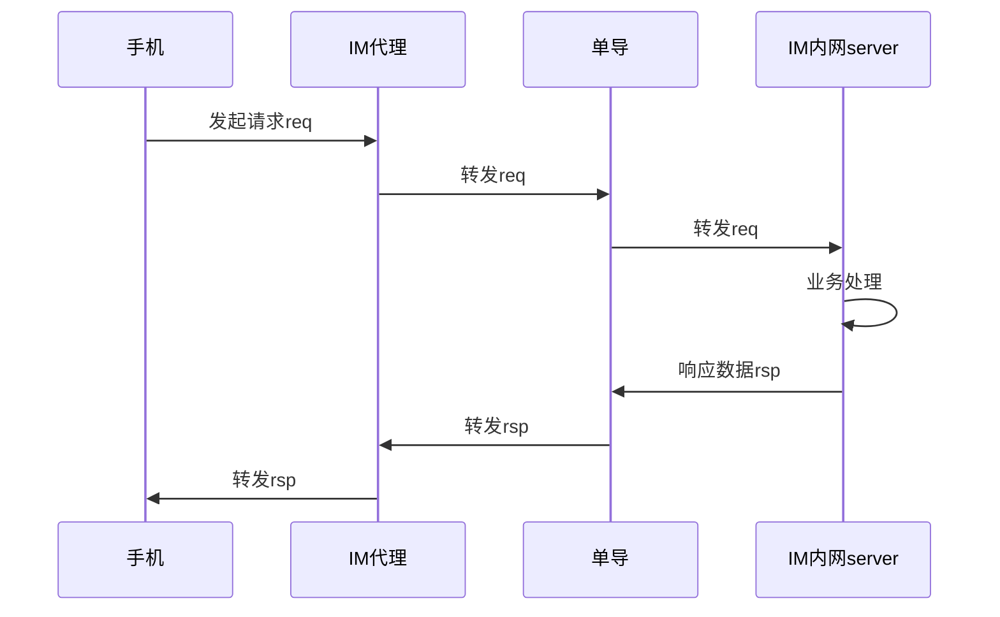

# learn-java

```mermaid
sequenceDiagram
    手机          ->> IM代理         : 发起请求req
    IM代理        ->> 单导           : 转发req
    单导          ->> IM内网server   : 转发req
    IM内网server  ->> IM内网server   : 业务处理
    IM内网server  ->> 单导           : 响应数据rsp
    单导          ->> IM代理         : 转发rsp
    IM代理        ->> 手机           : 转发rsp
```
